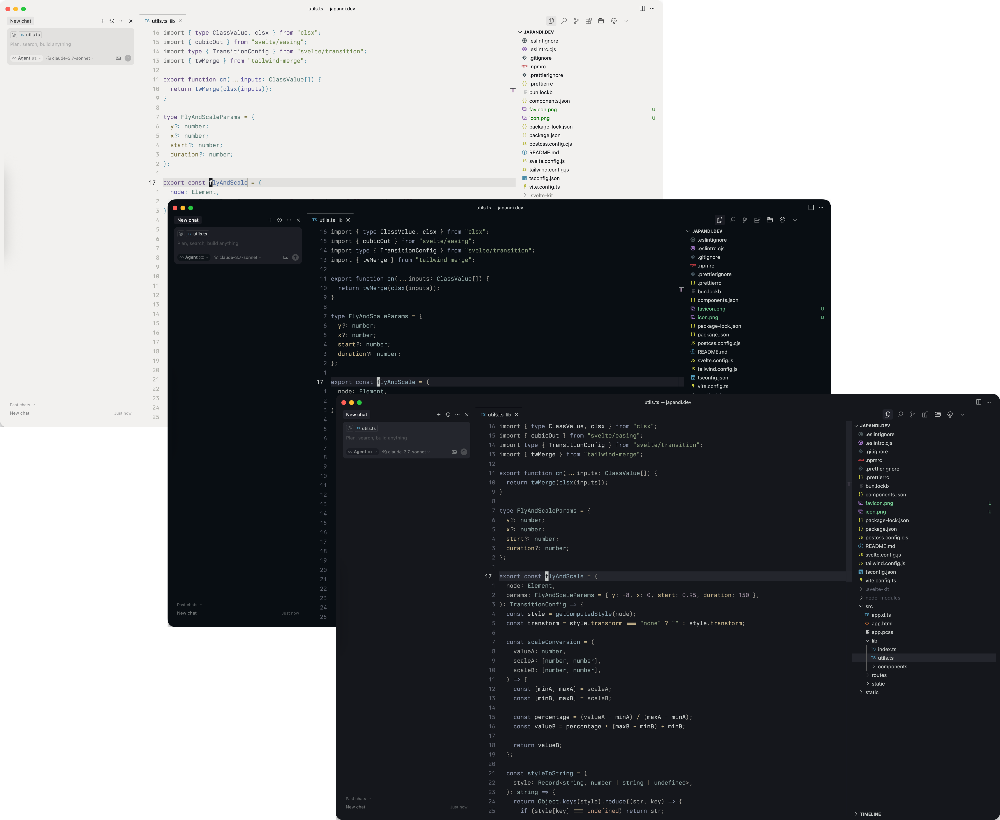
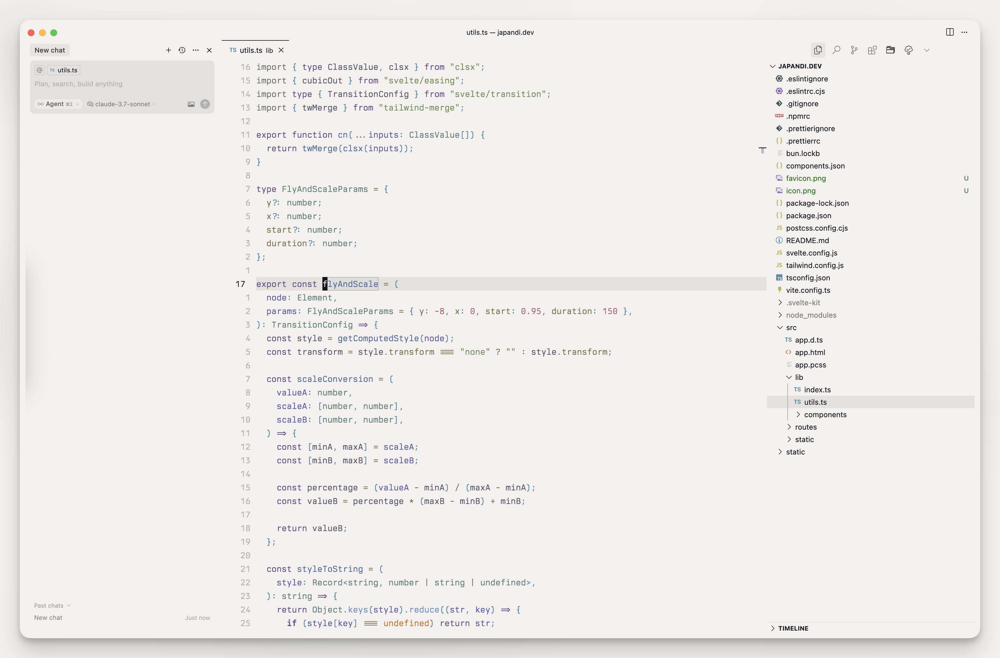

  <h1>🌊 Kansō VSCode Theme 🌊</h1>

  

    Kansō is an elegant evolution of the original Kanagawa theme.
     
    A dark theme that invites <em>focus</em>, not attention.
  

  

 

  

## ✨ Features

- 🎨 Three beautiful theme variants to match your mood and environment
- 👁️ WCAG 2.1 AA compliant for comfortable code readability
- 🧠 Thoughtful color selections for improved syntax highlighting
- 🔍 Balanced visual hierarchy to reduce visual noise
- 🌙 Comfortable contrast levels for reduced eye strain

## 📦 Installation

1. Open **Extensions** in VS Code (`Ctrl+Shift+X` / `Cmd+Shift+X`)
2. Search for `Kansō`
3. Click **Install**
4. Go to **File > Preferences > Color Theme** and select one of the Kansō variants

## 🎨 Themes

Kansō comes in three beautiful variants:

  <h3>✧ Zen ✧</h3>
  
Deep & rich dark theme for focused coding.

  
    

  <h3>✧ Ink ✧</h3>
  
Balanced theme with elegant contrast.

  
    

  <h3>✧ Pearl ✧</h3>
  
Light theme for daytime productivity.

  

 

## 🔤 Font recommendations

For the best experience, a high-quality font is recommended:

- [Berkeley Mono](https://usgraphics.com/products/berkeley-mono) (Paid)
- [Iosevka](https://github.com/be5invis/Iosevka) (Free)
- [Monaspace](https://monaspace.githubnext.com/) (Free)

## 🧩 Extras

Check out these matching themes for other applications:

- [Kansō for Neovim](https://github.com/webhooked/kanso.nvim)
- [Kansō for Zed](https://github.com/webhooked/kanso-zed)
- [Alacritty](https://github.com/rebelot/kanagawa.nvim/tree/master/extras/alacritty)
- [Kitty](https://github.com/rebelot/kanagawa.nvim/tree/master/extras/kitty)
- [Wezterm](https://github.com/rebelot/kanagawa.nvim/tree/master/extras/wezterm)

## 💎 Credits

The theme is inspired by the Kanagawa theme.

- [rebelot](https://github.com/rebelot/kanso.nvim) for the original Kanagawa Neovim theme
- [metapho-re](https://github.com/metapho-re/kanagawa-vscode-theme) for the VS Code theme template

## 📄 License

This project is licensed under the MIT License - see the [LICENSE](LICENSE) file for details.
